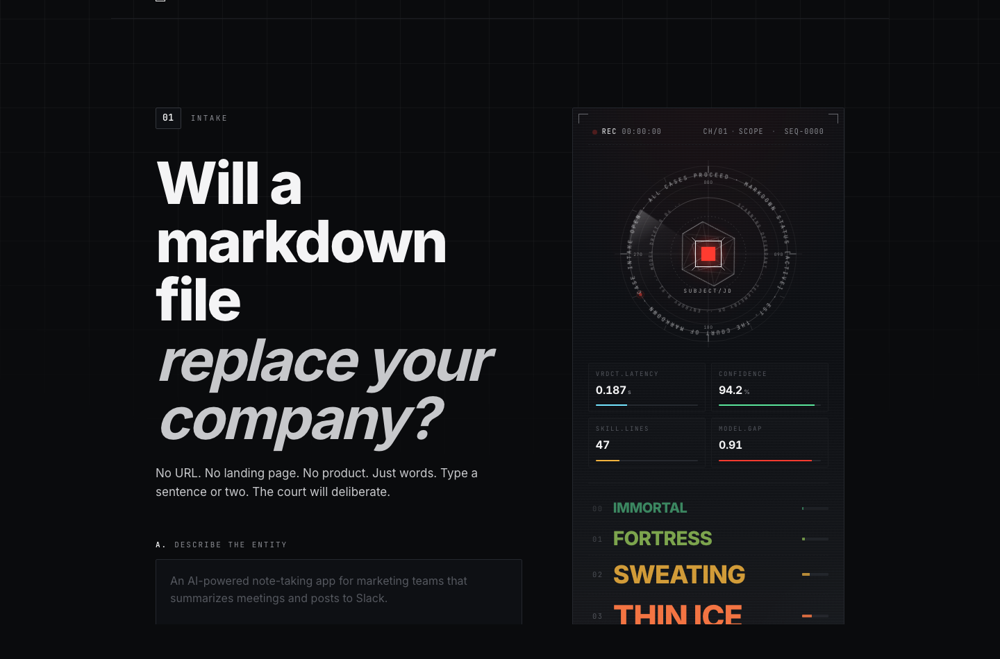
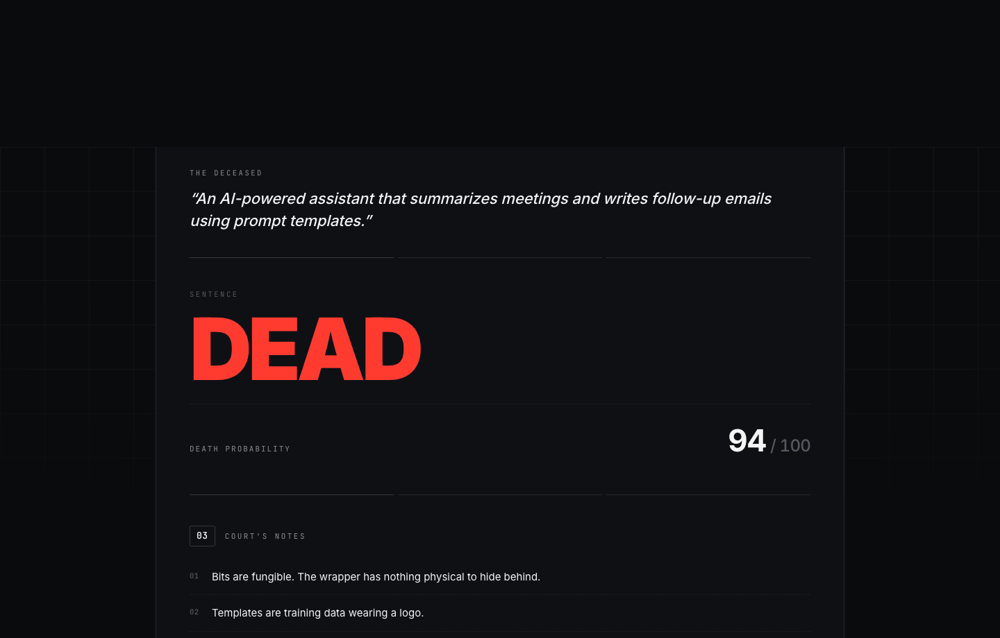
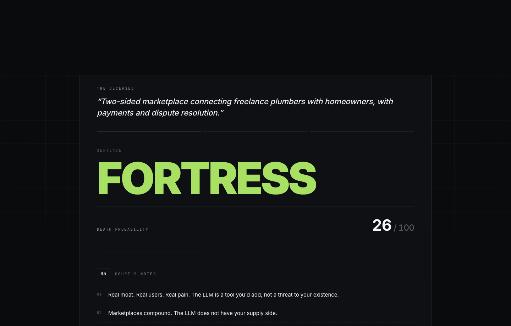
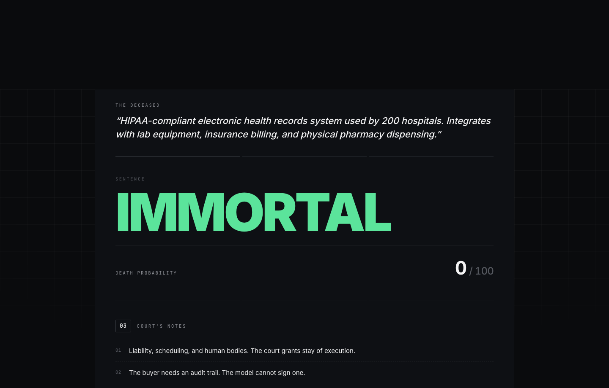

# AI Death

[](https://ai-death.vercel.app)
[](https://www.npmjs.com/package/ai-death)
[](LICENSE)
[](package.json)

> Will a markdown file replace your company? Type a sentence, find out.

**Live:** https://ai-death.vercel.app

A satirical web app and CLI that rates a company description on its likelihood of being replaced by a Claude Skill — a `.md` file. Five tiers from **IMMORTAL** to **DEAD**, deterministic in-browser scorer, optional context controls, an animated court HUD that does way too much.

[](https://ai-death.vercel.app)

## Try it in 5 seconds

```sh
npx ai-death
```

Boots a local server at `http://127.0.0.1:5173`. No install, no API key, no account.

[](https://vercel.com/new/clone?repository-url=https%3A%2F%2Fgithub.com%2Fvnmoorthy%2Fai-death&project-name=ai-death&repository-name=ai-death)

## What you get

Click any row to see the live verdict on ai-death.vercel.app:

| Description | Tier | Score |
|---|---|---|
| [*"AI assistant that summarizes meetings and writes follow-up emails using prompt templates."*](https://ai-death.vercel.app/#desc=An%20AI-powered%20assistant%20that%20summarizes%20meetings%20and%20writes%20follow-up%20emails%20using%20prompt%20templates.&stage=idea&buyer=consumer&surface=software) | `DEAD` | 94 |
| [*"Two-sided marketplace connecting freelance plumbers with homeowners, with payments and dispute resolution."*](https://ai-death.vercel.app/#desc=Two-sided%20marketplace%20connecting%20freelance%20plumbers%20with%20homeowners%2C%20with%20payments%20and%20dispute%20resolution.) | `FORTRESS` | 26 |
| [*"HIPAA-compliant electronic health records system used by 200 hospitals. Integrates with lab equipment, insurance billing, and physical pharmacy dispensing."*](https://ai-death.vercel.app/#desc=HIPAA-compliant%20electronic%20health%20records%20system%20used%20by%20200%20hospitals.%20Integrates%20with%20lab%20equipment%2C%20insurance%20billing%2C%20and%20physical%20pharmacy%20dispensing.&stage=contracts&buyer=regulated&surface=compliance) | `IMMORTAL` | 0 |

The court delivers a verdict, a death probability, three sharpened roast notes, and a mock `.md` skill that would replace the product.

| | |
|---|---|
|  |  |
| **DEAD** — wrappers, summarizers, drafters, "AI-powered X" | **FORTRESS** — marketplaces, networks, deep integrations |


*IMMORTAL — compliance gates, regulated buyers, atoms, contracts*

## Why this exists

A lot of SaaS today is a UI wrapper on logic that an LLM can replicate. A subset isn't, because it has real moats: regulators, atoms, networks, contracts. This is a court that helps you tell the difference, in one sentence.

The premise is mean enough to be useful. If you can't say what your product does in a way that survives the court, the product probably doesn't survive the next year of model releases either.

## Tier ladder

| Tier | Score | Vibe |
|---|---|---|
| `IMMORTAL` | 0 – 19 | Compliance, hardware, real-world ops. Stay of execution granted. |
| `FORTRESS` | 20 – 39 | Network effects, marketplaces, deep integrations. |
| `SWEATING` | 40 – 59 | Solid product, but the LLM is closing in. |
| `THIN ICE` | 60 – 79 | Mostly a UI on top of GPT/Claude with a logo. |
| `DEAD` | 80 – 100 | Could be a one-page markdown skill. Funeral arrangements. |

## Optional context

Below the description, three pill rows can sharpen the verdict by ±42 points and pull tier-aware roast notes:

- **Stage** — Idea / Pre-launch / Has users / Paying customers / Enterprise contracts
- **Buyer** — Consumer / SMB / Mid-market / Enterprise / Regulated
- **Surface** — Pure software / Hardware / Physical ops / Compliance gates

Same description, very different verdict. An idea-stage consumer wrapper reads `THIN ICE / DEAD`. The same idea pivoted to enterprise-contract regulated compliance gates lands `FORTRESS / IMMORTAL`.

## Shareable verdicts

Pre-bake a verdict by encoding the description (and optional context) in the URL hash:

```
https://ai-death.vercel.app/#desc=ENCODED_TEXT&stage=paying&buyer=enterprise&surface=compliance
```

The form auto-submits on load, so you can drop these into Slack/X/HN comments. A few primed examples:

- [`DEAD` — chatbot wrapper](https://ai-death.vercel.app/#desc=A%20ChatGPT-powered%20chatbot%20that%20answers%20questions%20about%20your%20company%27s%20documents.&stage=idea&buyer=smb&surface=software)
- [`THIN ICE` — note-taking app](https://ai-death.vercel.app/#desc=AI-powered%20note-taking%20app%20for%20marketing%20teams%20that%20summarizes%20meetings%20and%20posts%20to%20Slack.&stage=users&buyer=smb&surface=software)
- [`SWEATING` — vertical SaaS for dental clinics](https://ai-death.vercel.app/#desc=Vertical%20SaaS%20for%20dental%20clinics%3A%20scheduling%2C%20patient%20records%2C%20and%20insurance%20claims.&stage=paying&buyer=smb)
- [`FORTRESS` — freelance plumber marketplace](https://ai-death.vercel.app/#desc=Two-sided%20marketplace%20connecting%20freelance%20plumbers%20with%20homeowners%2C%20with%20payments%20and%20dispute%20resolution.)
- [`IMMORTAL` — HIPAA EHR for hospitals](https://ai-death.vercel.app/#desc=HIPAA-compliant%20electronic%20health%20records%20system%20used%20by%20200%20hospitals.%20Integrates%20with%20lab%20equipment%2C%20insurance%20billing%2C%20and%20physical%20pharmacy%20dispensing.&stage=contracts&buyer=regulated&surface=compliance)

## How the scorer works

100% client-side, deterministic, no API calls.

1. Start at 50.
2. **Decrement** for moat keywords: `hipaa`, `hardware`, `marketplace`, `payments`, `compliance`, `network`, `enterprise`, `regulated`, … (~40 patterns).
3. **Increment** for wrapper keywords: `summariz`, `chatbot`, `wrapper`, `cold email`, `template`, `resume rewrite`, … (~40 patterns).
4. Apply the optional Stage / Buyer / Surface shifts.
5. Length signals: very short input is vague (penalty), very long is specific (small mercy).
6. Add deterministic noise from a hash of the input + context, so identical inputs are stable but the spread feels alive.
7. Clamp 0 – 100, map to tier.

Lexicons live at the top of [`app.js`](app.js): `MOATS`, `REPLACEABLE`, `TIERS`, `TAGGED_ROASTS`, `CONTEXT_SHIFTS`, `CONTEXT_ROASTS`, plus the per-tag verb map inside `buildSkill`. Tweaking is one regex away.

## Repo

```
.
├── index.html           ← markup + verdict-card template
├── styles.css           ← design tokens, tier colors, court-HUD animations
├── app.js               ← scorer, roast bank, render
├── bin/ai-death.js      ← zero-dep Node http server (Node 18+)
├── package.json         ← npm bin, files allowlist
├── DESIGN.md            ← design system source of truth
└── docs/screenshots/    ← README assets + 1200×630 OG card
```

## Run from source

It's static HTML/CSS/JS. Any static server works.

```sh
git clone https://github.com/vnmoorthy/ai-death.git
cd ai-death
python3 -m http.server 5173
```

Then open http://localhost:5173.

## Deploy

Drop the folder on any static host:

- **Netlify / Vercel / Cloudflare Pages** — drag the folder into the dashboard.
- **GitHub Pages** — Settings → Pages → deploy from `main` / `/`.
- **Anywhere with `python3 -m http.server`** — same as local.

Zero environment variables. Zero keys.

## What this is NOT

- Not a real evaluation tool. Don't make decisions based on the verdict.
- Not a lead-gen page. No email capture, no waitlist, no analytics.
- Not advice. Probably not even useful. Definitely funny if your description is bad.

## License

[MIT](LICENSE) © vnmoorthy
